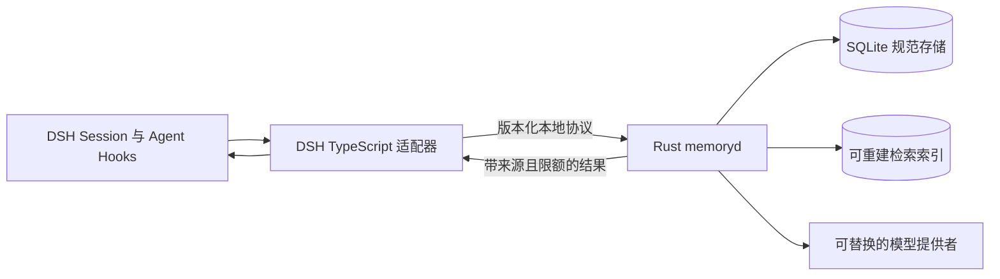

# 03 架构与技术决策

## 1. 进程与依赖方向

第一版采用一个 Rust 内核进程加一个薄 DSH 适配器。适配器只负责从宿主取得可信身份、会话事件与 Agent 生命周期，将协议请求交给内核，再把内核返回的上下文接到 DSH。记忆规则、状态、检索和存储位于 Rust 侧。这样 Rust 是产品主体，DSH 只是首个接入面。



初版使用本机 loopback HTTP + JSON，监听地址固定为 `127.0.0.1`，版本路径 `/v1`。这样可以分别运行 Rust 与 Node，而不要求 Node 原生扩展或 DSH 与 Rust 同进程。多实例、远程访问和 TLS 不属于首版。API 认证使用每用户独立随机令牌，服务端由令牌确定 scope；不能把用户 ID、令牌或模型密钥写入 Prompt。HTTP 是部署决策，不改变内核 API 的语言无关语义。

Rust 适合此处的长驻本机进程、强类型状态机、SQLite 事务和可复用跨宿主协议；交付成本是需要保留一个很薄的 DSH TypeScript 包以及进程间协议。首版不通过 FFI 把 Rust 动态库塞进 Node，因为 Windows 打包、崩溃边界和宿主升级会让接入更紧。将来若要嵌入移动端，可在不改变 `memory-domain` 的前提下新增进程内绑定。

## 2. Rust 模块划分

固定的 Cargo workspace 目录：

```text
agent-memory/
├── crates/
│   ├── memory-contract/      # ID、请求／响应、错误码、Schema 版本
│   ├── memory-domain/        # 状态机、作用域、权威规则，纯 Rust
│   ├── memory-store-sqlite/  # 事务、迁移、任务队列、索引维护
│   ├── memory-extract/       # 模型适配协议、Prompt 输入输出校验
│   ├── memory-recall/        # 查询解析、过滤、排序、上下文编译
│   └── memory-server/        # HTTP、认证、生命周期与观测
├── adapters/dsh/             # 独立 TypeScript 插件包
├── migrations/               # 有序 SQL 迁移；仅 Rust store 执行
└── doc/                      # 本目录可复制入未来新仓库
```

依赖方向：`contract` 无业务依赖；`domain` 只依赖 `contract`；store、extract、recall 依赖 domain；server 组合其余模块。DSH 适配器只依赖公开协议，不直接打开 SQLite。程序内部端口包括 `EvidenceRepository`、`MemoryRepository`、`JobRepository`、`Extractor`、`SearchIndex`、`Clock`。抽象只在出现第二实现或确实需要隔离副作用时设立，避免为每个函数创建接口。

## 3. 规范数据与索引

**本项目决策：SQLite 是首版规范存储。** 表内保存证据、记忆、证据关系、状态转换、任务与审计。SQLite 事务完成后，写入才算成功。数据库开启 WAL、外键和合理的 busy timeout；所有修改同一记忆的事务须检查版本。单用户和本机多会话可以共享同一数据库。

检索索引属于派生状态。首版同时使用 SQLite FTS5 `unicode61` 处理拉丁文，以及受 scope 限制的 Unicode 二元字索引处理中文；索引都由规范表重建。1 字短查询只在本用户最近 500 条 active 记录上做有界子串匹配。详细算法见 [13-算法与模型契约](13-算法与模型契约.md)。

Markdown 用作人工可读导出或以后可编辑的投影，不是首版双写的第二个事实库。若以后支持手工编辑导出文件，必须通过导入事务、版本冲突检查和来源记录回写规范库；直接修改导出文件不自动改变运行时事实。

## 4. 背景任务

事件接收和记忆提取分开：`ingest` 事务内写证据并按 `(tenant,user,session,window)` 建立幂等任务；worker 在会话结束／显式 flush 后批量提取。任务表的状态为 `queued/running/succeeded/retryable_failed/dead`，保存重试次数、下次运行时间、错误类别和模型调用用量。单进程 worker 用 SQLite claim 事务即可；不引入 Redis。任务超时和进程重启后，过期 lease 可重新领取，写入以 idempotency key 与唯一约束去重。

模型返回结构化候选，内核做字段、来源、作用域和冲突校验。模型失败只影响派生速度，不应丢失已经提交的原始事件。检索和用户纠错不依赖提取 worker 在线。

## 5. 模型提供者与费用边界

首版提供一个由 Rust 服务调用的 OpenAI 兼容提取客户端。模型名称、base URL、请求超时与最大输出长度可配置；模型密钥从文件读取，不能来自对话文本或写入 Prompt。DSH 适配器仅持有本用户内核访问令牌，不向 Rust 传 DSH 内部模型对象。

调用触发：显式 flush、会话结束、或已有消息到达固定的最大批量。默认先采用“会话结束一次提取”；阈值调整须由运行日志证明必要。相同窗口的重试必须复用相同任务键；失败重试有限次，之后进入 dead 状态供人工重跑。记录 token／时长，但不强制做大规模在线实验。

## 6. 决策记录

| ID | 决策 | 理由与来源 | 影响 |
|---|---|---|---|
| ADR-001 | Rust 核心进程 + DSH 薄适配器 | 用户要求 Rust 优先、第一版接 DSH；避免内核类型绑死于 DSH | 需要版本化进程协议 |
| ADR-002 | `(tenant_id,user_id)` 默认共享 | 用户明确决定同用户不同 Agent 互读、跨用户隔离 | 每个读写都从可信上下文绑定 scope |
| ADR-003 | SQLite 规范存储 | TencentDB 本地 SQLite、Hindsight 事务与证据关联；首版部署轻 | 人工编辑 Markdown 需导入机制 |
| ADR-004 | 原始证据先持久化、派生异步 | EverOS buffer→episode→派生、TencentDB L0→L1 | 模型失败可恢复，最终一致需可见 |
| ADR-005 | 关键词检索先行 | EverOS keyword 无模型依赖；用户不愿 API 海试 | 向量／图功能后置 |
| ADR-006 | 可用记忆必须有证据 | Hindsight observation 的来源链、TencentDB L1 `source_message_ids` | 候选校验与查询过滤不可省略 |
| ADR-007 | 自动上下文有上限 | TencentDB L3/L2 索引注入、按需工具读取 | 详细原文通过搜索工具取得 |

任何调整 ADR-001～007 的改动都要同步更新 [01-目标与边界](01-目标与边界.md) 和对应的流程文档。
